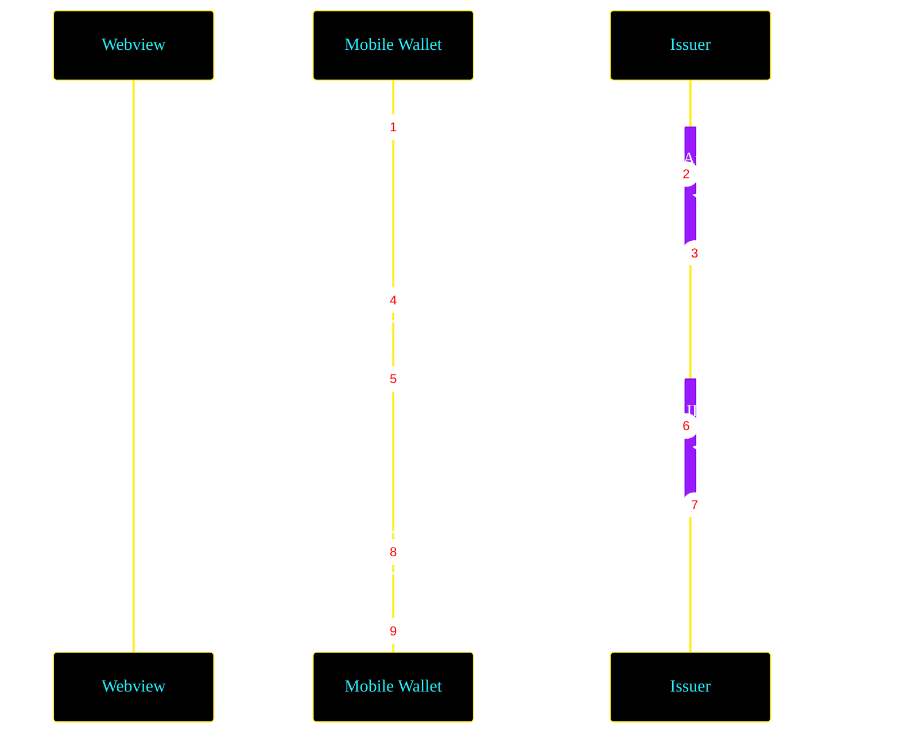

import Shnip from "@site/src/components/Shnip";
import {
  LanguageSwitcher,
  LanguageContent,
} from "@site/src/components/LanguageSwitcher";
import CodeBlock from "@theme/CodeBlock";
import Dependencies from "@site/src/components/Dependencies";

# Issuing a Known Customer Credential

Known Customer Credentials (KCCs) are [Verifiable Credentials](/docs/web5/verifiable-credentials/what-are-vcs) designed to streamline the Know Your Customer (KYC) process for tbDEX protocol users. KCCs help in gaining access to PFIs providing regulated financial services.

For a comprehensive exploration of the practical applications and compliance considerations of KCCs, refer to our [KCC Compliance Guide](https://www.tbdex.io/guides/kcc) which provides detailed examples and insights into how KCCs align with certain regulatory requirements, offering valuable context for those overseeing the implementation and management of KCCs.

:::danger Important
This guide is intended for educational purposes only and does not constitute legal advice. Compliance programs may have varying requirements. Consult your legal and/or compliance advisors to ensure that the KCC is consistent with your legal and compliance obligations.
:::

In this guide, we'll cover:

- Performing Identity Verification (IDV) as a necessary step **before** issuing a Known Customer Credential (KCC), by implementing an HTTP API conformant with [Self Issued OpenID Provider V2 (SIOPv2)](https://openid.github.io/SIOPv2/openid-connect-self-issued-v2-wg-draft.html) and [OpenID for Verifiable Presentation's (OID4VP)](https://openid.net/specs/openid-4-verifiable-presentations-1_0.html).
- Designing and detailing the required properties of a KCC.
- Issuing a KCC conformant with [OpenID for Verifiable Credential Issuance (OID4VCI)](https://openid.net/specs/openid-4-verifiable-credential-issuance-1_0.html) following successful IDV.

:::info
For a detailed guide on managing Known Customer Credentials as a Wallet application, please refer to the [Known Customer Credential Guide for Wallet Apps](/docs/tbdex/issuer/kcc/kcc-wallet)
:::

## Environment Setup

If you haven't already, please follow the [Credential Issuance Server Setup Guide](/docs/tbdex/issuer/vc-serverSetup) for detailed instructions on the dependencies and packages needed to set up your server.

## IDV Process

Identity Verification is a critical component of typical KYC requirements, where certain types of Personally Identifying Information (PII) are collected and verified from an individual. IDV is a crucial step before a KCC can be issued.



The IDV flow begins when the customer's agent (e.g. Wallet application) sends an HTTP request to the Issuer's [IDV service endpoint](https://hackmd.io/4cW3D9BVQGCEuf1CEg47jA?both#Issuers-Identity) specified in the Issuer's [Decentralized Identifier (DID) Document](/docs/glossary#did-document).

### 1. Handling Incoming Requests

Implement an endpoint to handle incoming GET requests from the Wallet. When a request is received, you'll need to construct the [SIOPv2 Authorization Request](https://openid.github.io/SIOPv2/openid-connect-self-issued-v2-wg-draft.html#section-9).

### Approach 1: Requesting only [`id_token`](https://openid.github.io/SIOPv2/openid-connect-self-issued-v2-wg-draft.html#name-self-issued-id-token)

When a Verifiable Presentation is **not** an accepted form of IDV, you can respond to the customer's Wallet application by requesting only an `id_token` from them:

<Shnip
  snippets={[
    {
      snippetName: "siopv2InitiateId_tokenEndpointIssuerJs",
      language: "JavaScript",
      title: "Issuer api.js for id_token only ",
    },
    {
      snippetName: "siopv2InitiateId_tokenEndpointIssuerKT",
      language: "Kotlin",
      title: "Issuer Application.kt for id_token only",
    },
  ]}
/>

:::note
`id_token` is a Self Issued Identity Token, that authenticates the customer to the Issuer by sharing the customer's Decentralized Identifier. This guide will cover an example `id_token` to learn more refer to [OpenID's specs](https://openid.github.io/SIOPv2/openid-connect-self-issued-v2-wg-draft.html#name-self-issued-id-token).
:::

### Approach 2: Requesting both `id_token` and [`vp_token`](https://openid.net/specs/openid-4-verifiable-presentations-1_0.html#section-6.1-2.2)

When a Verifiable Presentation is an accepted form of IDV, you can respond to the customer's Wallet application by requesting an `id_token` and a `vp_token` from them:

<Shnip
  snippets={[
    {
      snippetName: "siopv2InitiateId_tokenAndVp_tokenEndpointIssuerJs",
      language: "JavaScript",
      title: "Issuer api.js for id_token and vp_token",
    },
    {
      snippetName: "siopv2InitiateId_tokenAndVp_tokenEndpointIssuerKT",
      language: "Kotlin",
      title: "Issuer Application.kt for id_token and vp_token",
    },
  ]}
/>

The SOIPv2 Authorization request above that you as the issuer send to your customer contains the following key information about you as well as a [Presentation Definition](/docs/web5/verifiable-credentials/presentation-definition).

- **`client_id`**: Issuer's DID, establishing the issuer/requestor's identity.
- **`response_type`**: Lets the Wallet know the desired format, with `id_token` being required identity token and `vp_token` for _optional_ verifiable presentation token. The inclusion of `vp_token` means a presentation definition is required within the request.
- **`response_uri`**: Indicates the callback url for the Wallet, ensuring direct communication between the Wallet and the Issuer.
- **`nonce`**: A unique identifier tying together the request and its response.

:::note
`vp_token` is a [Verifiable Presentation](/docs/glossary#verifiable-presentation) that contains certified and authenticated claims about the customer. In this guide, we'll cover an example `vp_token`. To learn more refer to [OpenID's specs](https://openid.net/specs/openid-4-verifiable-presentations-1_0.html#section-6.1-2.2).
:::

### 2. Encode the SIOPv2 Authorization Request and respond:

<Shnip
  snippets={[
    {
      snippetName: "encodeSiopv2AuthRequestIssuerJs",
      language: "JavaScript",
      title: "Issuer api.js",
    },
    {
      snippetName: "encodeSiopv2AuthRequestIssuerKT",
      language: "Kotlin",
      title: "Issuer Application.kt",
    },
  ]}
/>

### 3. Wallet's SIOPv2 Authorization Response

The Wallet will then respond with an HTTP POST [SIOPv2 Authorization Response](https://openid.github.io/SIOPv2/openid-connect-self-issued-v2-wg-draft.html#section-10). The HTTP request body must include an `id_token` and optionally a `vp_token`, both of which must be [JSON Web Tokens (JWTs)](https://datatracker.ietf.org/doc/html/rfc7519). Here is an example HTTP POST request body (which includes the optional `vp_token`):

```javascript
// Wallet.js example HTTP POST request body

{
    "id_token": "eyJhbGciOiJIUzI1NiIsInR5cCI6IkpXVCJ9.eyJpc3MiOiJkaWQ6ZGh0OmN1c3RvbWVyRGlkIiwic3ViIjoiZGlkOmRodDpjdXN0b21lckRpZCIsImF1ZCI6Imlzc3VlckRpZC51cmkiLCJub25jZSI6Im4tMFM2X1d6QTJNaiIsImV4cCI6MTYxODg4NDQ3MywiaWF0IjoxNjE4ODgwODczfQGUuY29tL2NyZWRlbnRpYWxzLzE4NzIiLCJ0eXBlIjpbIlZlcmlmaWFibGVDcmVkZW50aWFsIiwiSURDYXJkQ3JlZGVudGlhbCJdLCJpc3N1ZXIiOnsiaWQiOiJkaWQ6ZXhhbXBsZTppc3N1ZXIifSwiaXNzdWFuY2VEYXRlIjoiMjAxMC0wMS0wMVQxOToyMzoyNFoiLCJjcmVkZW50aWFsU3ViamVjdCI6eyJnaXZlbl9uYW1lIjoiRnJlZHJpayIsImZhbWlseV9uYW1lIjoiU3RyJm9tYmVyZyIsImJpcnRoZGF0ZSI6IjE5NDktMDEtMjIifX1dLCJob2xkZXIiOiJkaWQ6ZXhhbXBsZTpob2xkZXIiLCJwcm9vZiI6eyJ0eXBlIjoiRWQyNTUxOVNpZ25hdHVyZTIwMTgiLCJjcmVhdGVkIjoiMjAyMS0wMy0xOVQxNTozMDoxNVoiLCJjaGFsbGVuZ2UiOiJuLTBTNl9XekEyTWoiLCJkb21haW4iOiJodHRwczovL2NsaWVudC5leGFtcGxlLm9yZy9jYiIsImp3cyI6ImV5SmhiR2NpT2lKSVV6STFOaUo5LkhvbGRlcl9GT1JfU0lHTkFUVVJFIiwicHJvb2ZQdXJwb3NlIjoiYXV0aGVudGljYXRpb24iLCJ2ZXJpZmljYXRpb25NZXRob2QiOiJkaWQ6ZXhhbXBsZTpob2xkZXIja2V5LTEifX0"
}
```

The decoded [JWT Claims](https://datatracker.ietf.org/doc/html/rfc7519#section-4) for the `id_token` and `vp_token` are as follows:

```javascript
// Wallet.js id_token decoded JWT claims

{
  "iss": "did:dht:customerDid",
  "sub": "did:dht:customerDid", // Customer's DID string
  "aud": "did:dht:issuerDid", // Issuer's DID string
  "nonce": "n-0S6_WzA2Mj", // Unique string from the Issuer's Auth request
  "exp": 1618884473, // Expiration time
  "iat": 1618880873 // issued at time
}
```

```javascript
// Wallet.js vp_token decoded JWT claims

{
  "@context": [
    "https://www.w3.org/2018/credentials/v1",
    "https://identity.foundation/presentation-exchange/submission/v1"
  ],
  "type": ["VerifiablePresentation", "PresentationSubmission"],
  "presentation_submission": {
    "id": "epzZXstAcVNt5MRrcyG91",
    "definition_id": "IDCardCredentials",
    "descriptor_map": [
      {
        "id": "IDCardCredential",
        "format": "jwt_vc",
        "path": "$.vp.verifiableCredential[0]"
      },
      {
        "id": "nationalIdentifierVerification",
        "format": "jwt_vc",
        "path": "$.vp.verifiableCredential[1]"
      }
    ]
  },
  "verifiableCredential": [
    "eyJhbGciOiJFZERTQSIsInR5cCI6IkpXVCIsImtpZCI6ImRpZDprZXk6ejZNa2VyNDlDbnVnN2hzdkhEZ3Y0NHl2cGR2dE1oNHlMaURYeFM2N2huclVodHQyI3o2TWtlcjQ5Q251Zzdoc3ZIRGd2NDR5dnBkdnRNaDR5TGlEWHhTNjdobnJVaHR0MiJ9.eyJpc3MiOiJkaWQ6a2V5Ono2TWtlcjQ5Q251Zzdoc3ZIRGd2NDR5dnBkdnRNaDR5TGlEWHhTNjdobnJVaHR0MiIsInZjIjp7IkBjb250ZXh0IjpbImh0dHBzOi8vd3d3LnczLm9yZy8yMDE4L2NyZWRlbnRpYWxzL3YxIl0sInR5cGUiOlsiVmVyaWZpYWJsZUNyZWRlbnRpYWwiLCJFbXBsb3ltZW50Q3JlZGVudGlhbCJdLCJpZCI6InVybjp1dWlkOjcyNDhiOTkyLTkwOTYtNDk2NS1hMGVjLTc3ZDhhODNhMWRmYiIsImlzc3VlciI6ImRpZDprZXk6ejZNa2VyNDlDbnVnN2hzdkhEZ3Y0NHl2cGR2dE1oNHlMaURYeFM2N2huclVodHQyIiwiaXNzdWFuY2VEYXRlIjoiMjAyMy0xMi0yMVQyMDoxMToyNVoiLCJjcmVkZW50aWFsU3ViamVjdCI6eyJnaXZlbl9uYW1lIjoiRnJlZHJpayIsImZhbWlseV9uYW1lIjoiU3RyJm9tYmVyZyIsImJpcnRoZGF0ZSI6IjE5NDktMDEtMjIifX1dLCJob2xkZXIiOiJkaWQ6ZXhhbXBsZTpob2xkZXIiLCJwcm9vZiI6eyJ0eXBlIjoiRWQyNTUxOVNpZ25hdHVyZTIwMTgiLCJjcmVhdGVkIjoiMjAyMS0wMy0xOVQxNTozMDoxNVoiLCJjaGFsbGVuZ2UiOiJuLTBTNl9XekEyTWoiLCJkb21haW4iOiJodHRwczovL2NsaWVudC5leGFtcGxlLm9yZy9jYiIsImp3cyI6ImV5SmhiR2NpT2lKSVV6STFOaUo5LkhvbGRlcl9GT1JfU0lHTkFUVVJFIiwicHJvb2ZQdXJwb3NlIjoiYXV0aGVudGljYXRpb24iLCJ2ZXJpZmljYXRpb25NZXRob2QiOiJkaWQ6ZXhhbXBsZTpob2xkZXIja2V5LTEifX0"
  ]
}
```
